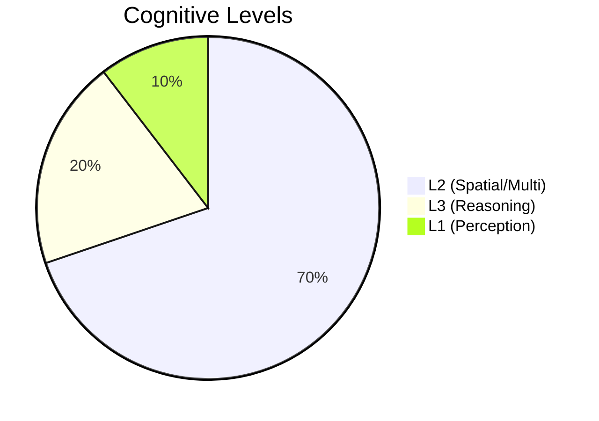
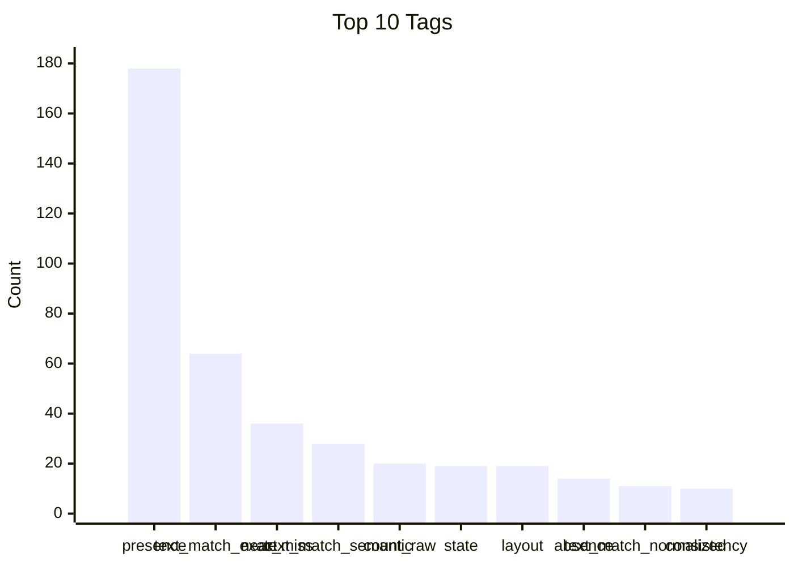

# Dataset Insights

Analysis of the current benchmark dataset (shots 001 to 008).

## Summary
- **Total Screenshots**: 8
- **Total Test Cases**: 192
- **Balance**: 133 PASS / 59 FAIL

## Tag Distribution

| Tag | Count | % |
|-----|-------|---|
| presence | 178 | 92.7% |
| text_match_exact | 64 | 33.3% |
| near_miss | 36 | 18.8% |
| text_match_semantic | 28 | 14.6% |
| count_raw | 20 | 10.4% |
| state | 19 | 9.9% |
| layout | 19 | 9.9% |
| absence | 14 | 7.3% |
| text_match_normalized | 11 | 5.7% |
| consistency | 10 | 5.2% |
| small_text | 9 | 4.7% |
| order | 7 | 3.6% |
| count_filtered | 5 | 2.6% |

## Cognitive Levels

## Tag Frequency (Quick View)

## Graphiques pour les slides

Pour générer des courbes et statistiques prêtes à insérer dans une présentation :

1. Installer la dépendance : `pip install -r requirements.txt` (matplotlib).
2. Lancer : `python scripts/plot_dataset_insights.py`
3. Les figures (PNG 300 dpi) et le rapport texte sont écrits dans **`docs/figures/`** :
   - `tags_distribution.png` — répartition des tags (bar chart)
   - `cognitive_levels.png` — niveaux L1/L2/L3 (pie chart)
   - `outcomes_balance.png` — balance PASS / FAIL
   - `insights_slides.md` — résumé et insights à copier-coller dans les slides

Option `--svg` pour exporter aussi en SVG : `python scripts/plot_dataset_insights.py --svg`.
